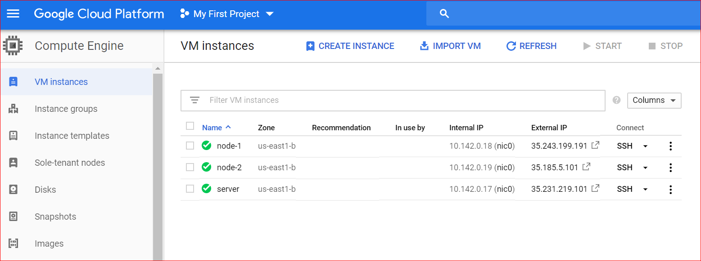
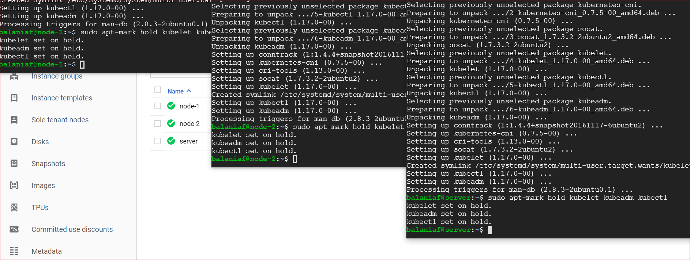
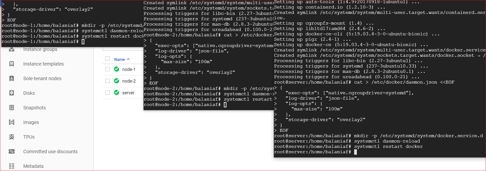
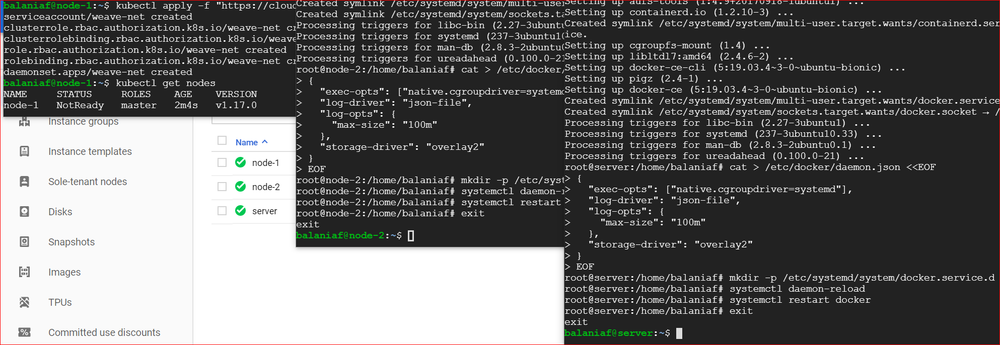
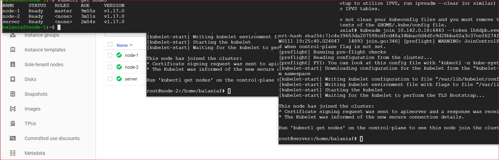
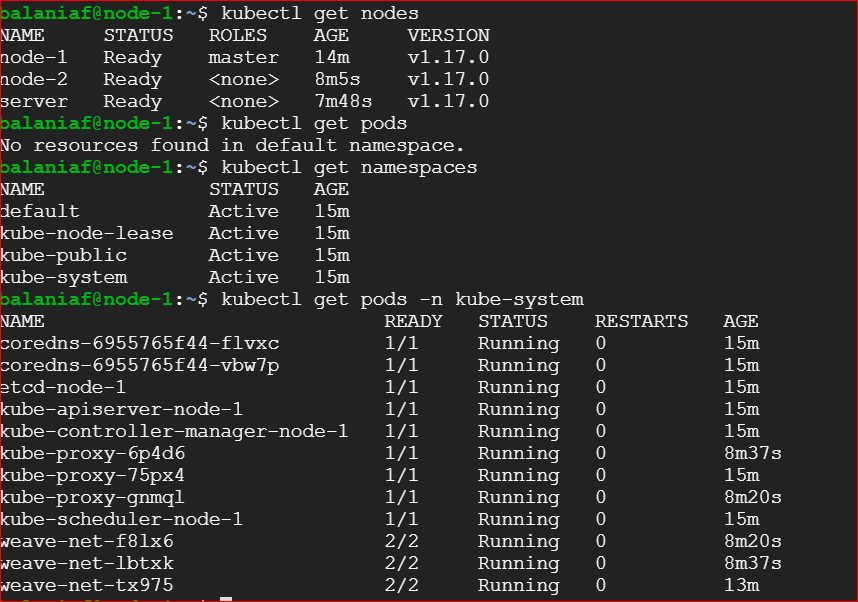

# Kubernetes Installation

  [Kubectl Installation](https://kubernetes.io/docs/setup/production-environment/tools/kubeadm/install-kubeadm/#installing-kubeadm-kubelet-and-kubectl) and [Docker](https://kubernetes.io/docs/setup/production-environment/container-runtimes/#docker), are the official sites, to be followed for installations.
  
  - Provision a Virtual machine
  - Install kubernetes 
  - Install docker
  - Install and Configure ```kubeadm``` in the kubernetes ```master```
  - Join other ```nodes``` with the ```master```
  - Verify the cluster
   
## 1. Provision the Virtual machines
  
  Create 4 machines of same configuration.
  - Ram 4GB, #of CPUs 2, Ubuntu 18.04 LTS, 10GB Hard Disk.
  - ```master node1 node2 node3```
  - Note: all the Virtual machines should be in the same network
  - Its applicable to any cloud providers
  - [GCE](https://console.cloud.google.com) and [AWS](https://console.aws.amazon.com). 


<details><summary>Show Output image</summary>
<p>
<br>

<br>
</p>
</details>

## 2. Install kubernetes
    
 Install kubectl,kubeadm and kubelet in all the ```nodes```.
  - Follow this link for 
  [Kubectl Installation](https://kubernetes.io/docs/setup/production-environment/tools/kubeadm/install-kubeadm/#installing-kubeadm-kubelet-and-kubectl).
  - Note: tested using ubuntu 18.04 LTS
  ```shell script
apt-get update && apt-get install -y apt-transport-https curl
curl -s https://packages.cloud.google.com/apt/doc/apt-key.gpg | apt-key add -
cat <<EOF >/etc/apt/sources.list.d/kubernetes.list
deb https://apt.kubernetes.io/ kubernetes-xenial main
EOF
apt-get update
apt-get install -y kubelet kubeadm kubectl 
apt-mark hold kubelet kubeadm kubectl 
```
<details><summary>Show Output images</summary>
<p>
<br>

<br>
</p>
</details>

## 3. Install Docker
  Install Community Edition for development purpose in all the ```nodes``` as a SUDO user.
  - Follow this link for [Docker CE Installation](https://kubernetes.io/docs/setup/production-environment/container-runtimes/#docker).
   ```shell script

apt-get update && apt-get install apt-transport-https ca-certificates curl software-properties-common -y
apt-get update && apt-get install apt-transport-https ca-certificates curl software-properties-common -y

curl -fsSL https://download.docker.com/linux/ubuntu/gpg | apt-key add -

add-apt-repository \
  "deb [arch=amd64] https://download.docker.com/linux/ubuntu \
  $(lsb_release -cs) \
  stable"

apt-get update && apt-get install docker-ce=18.06.2~ce~3-0~ubuntu -y

cat > /etc/docker/daemon.json <<EOF
{
  "exec-opts": ["native.cgroupdriver=systemd"],
  "log-driver": "json-file",
  "log-opts": {
    "max-size": "100m"
  },
  "storage-driver": "overlay2"
}
EOF

mkdir -p /etc/systemd/system/docker.service.d
systemctl daemon-reload
systemctl restart docker
``` 

<details><summary>Show Output images</summary>
<p>
<br>

<br>
</p>
</details>


## 4. Enable and Configure ```kubeadm``` in Kubernetes Master Server.

Enable ```kubeadm``` 
```shell
kubeadm init --apiserver-advertise-address $(hostname -i) --pod-network-cidr=192.168.0.0/16
mkdir -p $HOME/.kube
sudo cp -i /etc/kubernetes/admin.conf $HOME/.kube/config
sudo chown $(id -u):$(id -g) $HOME/.kube/config
export kubever=$(kubectl version | base64 | tr -d '\n')
```
- Install newtwork driver
```shell script
kubectl apply -f "https://cloud.weave.works/k8s/net?k8s-version=$kubever"
```
- Test the status of nodes
```shell script
kubectl get nodes
kubectl get pods --all-namespaces
kubectl get nodes --show-lables
kubectl get namespaces
```

<details><summary>Show Output images</summary>
<p>
<br>

<br>
</p>
</details>

## 5. Join the ```nodes``` with the ```master```

Execute the following command and get the join token from the ```master``` and copy it in clipboard.

   ```
   kubeadm token create --print-join-command
```

<details><summary>Show Output images</summary>
<p>
<br>

<br>
</p>
</details>

## 6. Test

Go to ```master``` and execute.
```
kubectl version
kubectl cluster-info
kubectl get pods -n kube-system
kubectl get events
```

<details><summary>Show Output images</summary>
<p>
<br>

<br>
</p>
</details>


<details><summary>Show history of commands</summary>
<p>
<br>

    1  sudo apt-get update && sudo apt-get install -y apt-transport-https curl
    2  curl -s https://packages.cloud.google.com/apt/doc/apt-key.gpg | sudo apt-key add -
    3  cat <<EOF | sudo tee /etc/apt/sources.list.d/kubernetes.list
deb https://apt.kubernetes.io/ kubernetes-xenial main
EOF

    4  sudo apt-get update
    5  sudo apt-get install -y kubelet kubeadm kubectl
    6  sudo apt-mark hold kubelet kubeadm kubectl
    7  apt-get update && apt-get install   apt-transport-https ca-certificates curl software-properties-common
    8  sudo apt-get update && apt-get install   apt-transport-https ca-certificates curl software-properties-common
    9  sudo su
   10  kubeadm init --apiserver-advertise-address $(hostname -i) --pod-network-cidr=192.168.0.0/16
   11  sudo su
   12  mkdir -p $HOME/.kube
   13  ls -al $HOME/.kube
   14  sudo su
   15  sudo cp -i /etc/kubernetes/admin.conf $HOME/.kube/config
   16  sudo chown $(id -u):$(id -g) $HOME/.kube/config
   17  export kubever=$(kubectl version | base64 | tr -d '\n')
   18  kubectl apply -f "https://cloud.weave.works/k8s/net?k8s-version=$kubever"
   19  kubectl get nodes
   20  kubeadm token create --print-join-command
   21  kubectl get nodes
   22  kubectl get pods
   23  kubectl get namespaces
   24  kubectl get pods -n kube-system
   
   <br>
</p>
</details>